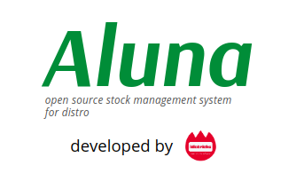

# aluna-apps
Aluna adalah sistem informasi stock management yang
dirancang khusus untuk aplikasi kelola stok untuk
distro-distro pakaian.



## Build Setup
Clone project ini ke direktori local Anda, lalu
masuk ke direktori project dan ketik:

``` bash
# install dependencies
npm install

# serve with hot reload at localhost:8080
npm run dev

# build for production with minification
npm run build

# build for production and view the bundle analyzer report
npm run build --report
```


